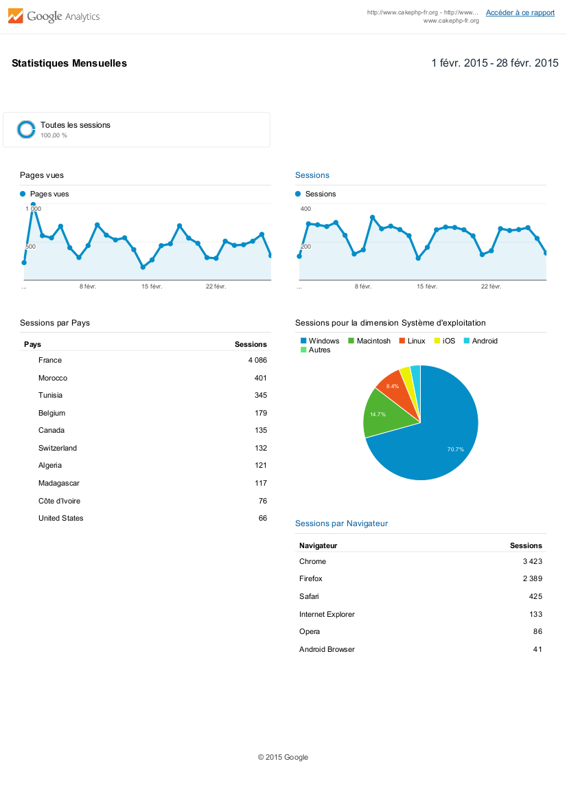

Meetups prévues
---------------

Aucune meetup prévue pour l'instant. Si vous souhaitez organiser un meetup dans votre ville, vous pouvez demander à real34 qui a un [compte sur meetup](http://www.meetup.com/CakePHP-Toulouse). Vous pouvez faire la demande sur le [forum](forum.cakephp-fr.org/viewtopic.php?id=7291)

Statistiques du site
--------------------

Un petit récap de l'activité du site pour le mois de février:

- Nombre d'inscriptions sur le site : 7
  Bienvenue à asphalt8hack, spark, kaoutar, Starkareffour Rim, alezyy, pinforet, jetroey!!
- Nombre de messages sur le forum Entraide :
- Nombre de messages sans réponse :

Pdf de statistiques de Google Analytics:

Dernières versions de CakePHP
-----------------------------

Au 1er mars 2015:
- [CakePHP 2.6.2](https://github.com/cakephp/cakephp/releases/tag/2.6.2)
- [CakePHP 3.0.0-RC2](https://github.com/cakephp/cakephp/releases/tag/3.0.0-RC2)

Ressources, Plugins & Contributions
-----------------------------------

- Vous pouvez faire une pull request sur [ce dépôt](https://github.com/cakephp-fr/cakephp-fr.github.io) pour ajouter les articles, plugins qui pourraient intéresser la communauté.

Merci à tous pour l'aide que vous avez pu apporter !

A bientôt et n'hésitez pas à nous contacter sur le
[forum](http://forum.cakephp-fr.org), [github](https://github.com/cakephp-fr),
[IRC](http://www.cakephp-fr.org/irc) ...
